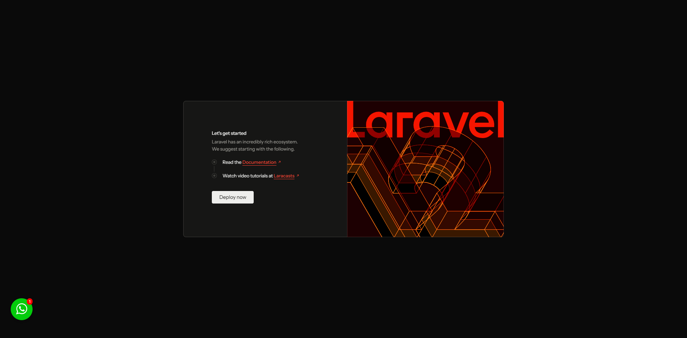
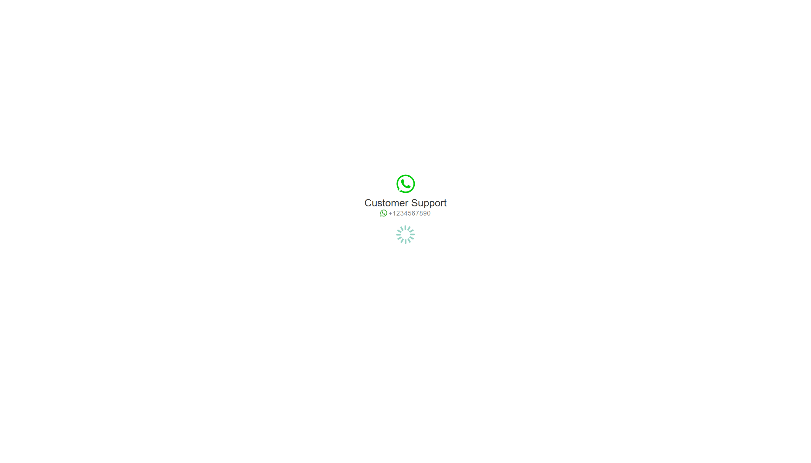

<div class="filament-hidden">


</div>

# Laravel Whatsapp Widget

[](https://packagist.org/packages/jeffersongoncalves/laravel-whatsapp-widget)
[](https://github.com/jeffersongoncalves/laravel-whatsapp-widget/actions?query=workflow%3Arun-tests+branch%3Amaster)
[](https://github.com/jeffersongoncalves/laravel-whatsapp-widget/actions?query=workflow%3A"Fix+PHP+code+styling"+branch%3Amaster)
[](https://packagist.org/packages/jeffersongoncalves/laravel-whatsapp-widget)

This Laravel package provides a simple yet customizable WhatsApp widget for your website. It allows you to easily add a clickable WhatsApp button or floating widget to connect visitors directly with your WhatsApp account. The widget is designed to be easily integrated into your Laravel application and is fully customizable to match your website's design.

## Features

- 🚀 **Multi-agent support**: Add multiple WhatsApp agents with different phone numbers and names
- 🎨 **Customizable appearance**: Change the widget's position, colors, and text
- 🔊 **Audio notifications**: Optional sound alert when the widget loads (configurable)
- 📱 **Mobile-friendly**: Responsive design that works on all devices
- 🌐 **Localization support**: Easily translate the widget to any language
- 🔄 **Pre-defined messages**: Set default text messages for each agent
- 🖼️ **Custom agent avatars**: Add profile pictures for each agent

## Screenshots

### Widget Position: Right (Default)


### Widget Position: Left


### Redirect Page


## Requirements

- PHP 8.2 or higher
- Laravel 11.0 or higher

## Installation

You can install the package via composer:

```bash
composer require jeffersongoncalves/laravel-whatsapp-widget
```

## Usage

### 1. Publish the package assets

Publish config file:

```bash
php artisan vendor:publish --tag=whatsapp-widget-config
```

Publish migration file:

```bash
php artisan vendor:publish --tag=whatsapp-widget-migrations
```

Publish assets files:

```bash
php artisan vendor:publish --tag=whatsapp-widget-assets
```

Publish translations files:

```bash
php artisan vendor:publish --tag=whatsapp-widget-translations
```

Publish views files:

```bash
php artisan vendor:publish --tag=whatsapp-widget-views
```

### 2. Run the migrations

```bash
php artisan migrate
```

### 3. Add the widget to your layout

Add the head template in your layout's `<head>` section:

```php
@include('whatsapp-widget::whatsapp-widget-head')
```

Add the body template before the closing `</body>` tag:

```php
@include('whatsapp-widget::whatsapp-widget-body')
```

### 4. Add WhatsApp agents

You need to add WhatsApp agents to your database. You can do this through your application's admin panel or by creating a seeder.

Example seeder:

```php
use JeffersonGoncalves\WhatsappWidget\Models\WhatsappAgent;

WhatsappAgent::create([
    'active' => true,
    'name' => 'Customer Support',
    'phone' => '+1234567890',
    'text' => 'Hello! I have a question about your product.',
    'image' => 'path/to/agent-avatar.jpg', // Optional
]);
```

## Configuration

After publishing the configuration file, you can customize the widget by editing the `config/whatsapp-widget.php` file:

```php
return [
    // Enable or disable audio notification
    'audio' => true,

    // Play audio notification once per day or on every page load
    'play_audio_daily' => true,

    // Filesystem disk for storing agent images
    'disk' => env('FILESYSTEM_DISK', 'local'),

    // Application URL (used for redirection)
    'url' => env('APP_URL', 'http://localhost'),

    // Application name (displayed in the widget)
    'name' => env('APP_NAME', 'Laravel App'),

    // WhatsApp API key (if needed)
    'key' => env('WHATSAPP_KEY'),

    // Widget position on the screen (left or right)
    'position' => 'right',
];
```

## Customization

### Translations

You can customize the widget's text by editing the translation files in `resources/lang/vendor/whatsapp-widget/`.

### Position

By default, the widget appears in the bottom-right corner of the page. You can change this by modifying the `position` value in the `config/whatsapp-widget.php` file.

Example for left position:

```php
'position' => 'left',
```


Example for right position:

```php
'position' => 'right',
```


### Redirect Page

When a user clicks on an agent, they are redirected to a temporary page before being sent to WhatsApp. This page can be customized by publishing the package views.


## Testing

```bash
composer test
```

## Changelog

Please see [CHANGELOG](CHANGELOG.md) for more information on what has changed recently.

## Contributing

Please see [CONTRIBUTING](.github/CONTRIBUTING.md) for details.

## Security Vulnerabilities

Please review [our security policy](../../security/policy) on how to report security vulnerabilities.

## Credits

- [Jèfferson Gonçalves](https://github.com/jeffersongoncalves)
- [All Contributors](../../contributors)

## License

The MIT License (MIT). Please see [License File](LICENSE.md) for more information.
