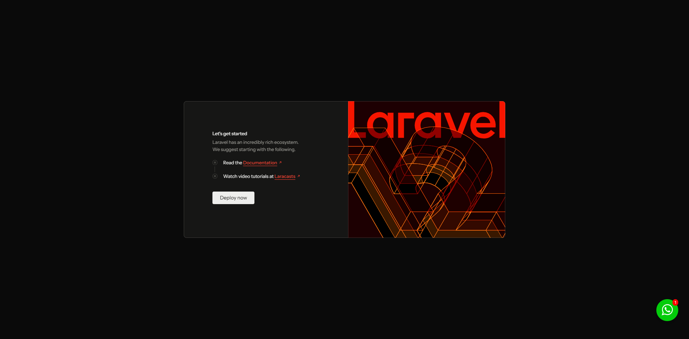
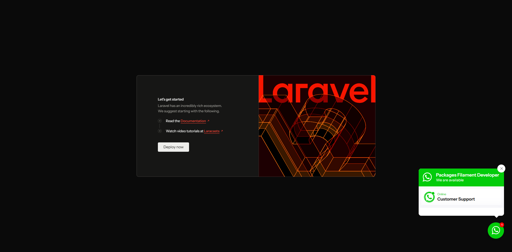
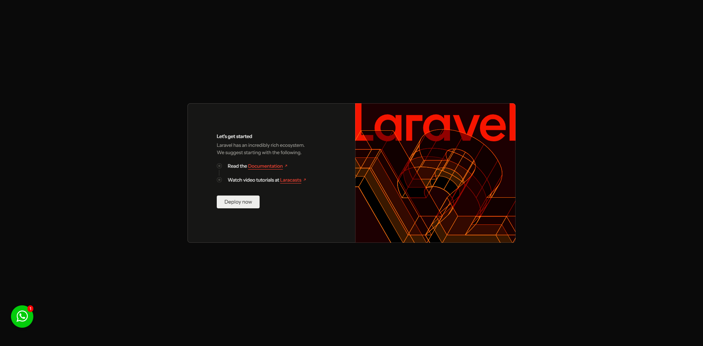
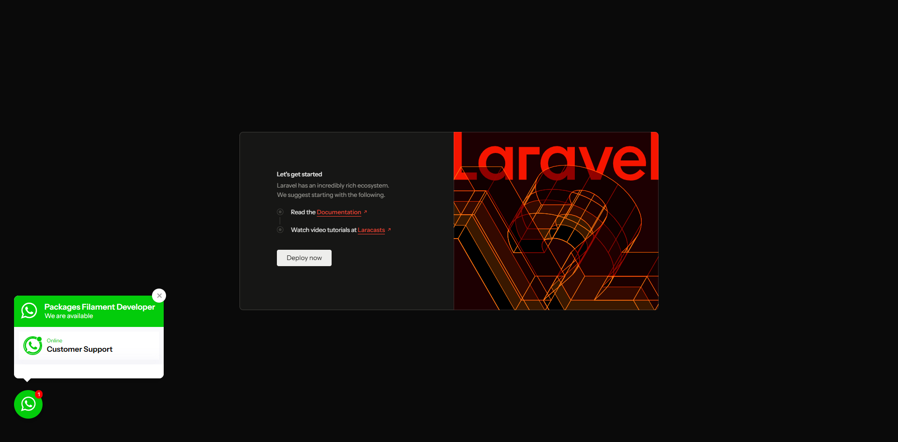
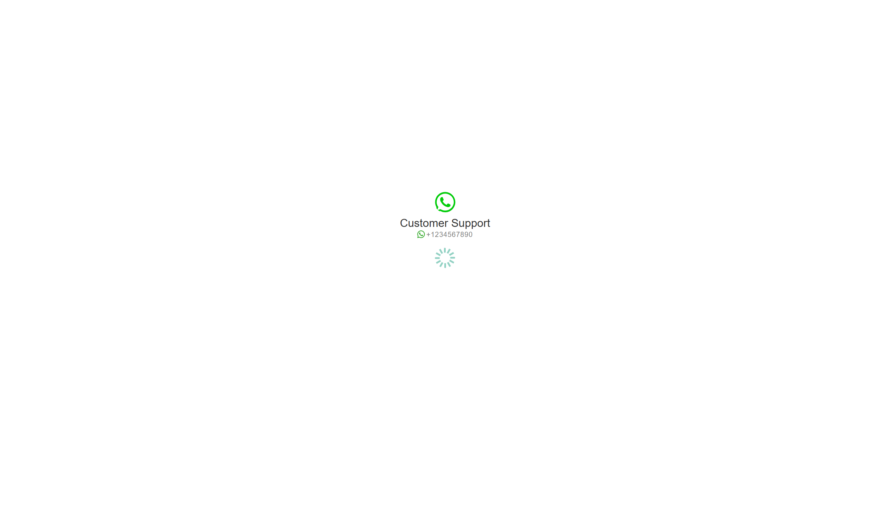

<div class="filament-hidden">


</div>

# Laravel Whatsapp Widget

[](https://packagist.org/packages/jeffersongoncalves/laravel-whatsapp-widget)
[](https://github.com/jeffersongoncalves/laravel-whatsapp-widget/actions?query=workflow%3Arun-tests+branch%3Amaster)
[](https://github.com/jeffersongoncalves/laravel-whatsapp-widget/actions?query=workflow%3A"Fix+PHP+code+styling"+branch%3Amaster)
[](https://packagist.org/packages/jeffersongoncalves/laravel-whatsapp-widget)

This Laravel package provides a simple yet customizable WhatsApp widget for your website. It allows you to easily add a clickable WhatsApp button or floating widget to connect visitors directly with your WhatsApp account. The widget is designed to be easily integrated into your Laravel application and is fully customizable to match your website's design.

## Features

- 🚀 **Multi-agent support**: Add multiple WhatsApp agents with different phone numbers and names
- ↔️ **Side selection**: Place the floating widget on the left or right of the screen
- 🎨 **Themeable colors**: Customize the button, modal and online status colors via config (no asset rebuild required)
- 🪟 **Modal customization**: Control the popup background, text and muted colors independently
- 🔀 **Redirect screen styling**: Customize the loading/redirect page background, text, accent and spinner colors
- 🖼️ **Custom icons**: Replace the trigger, fallback avatar and redirect icons with your own
- 🔊 **Audio notifications**: Optional sound alert when the widget loads (configurable)
- 📱 **Mobile-friendly**: Responsive design that works on all devices
- 🌐 **Localization support**: Easily translate the widget to any language
- 🔄 **Pre-defined messages**: Set default text messages for each agent
- 🖼️ **Custom agent avatars**: Add profile pictures for each agent

## Screenshots

### Widget Position: Right (Default)

| Closed | Open |
| :---: | :---: |
|  |  |

### Widget Position: Left

| Closed | Open |
| :---: | :---: |
|  |  |

### Redirect Page


## Requirements

- PHP 8.2 or higher
- Laravel 11.0 or higher

## Installation

You can install the package via composer:

```bash
composer require jeffersongoncalves/laravel-whatsapp-widget
```

## Usage

### 1. Publish the package assets

Publish config file:

```bash
php artisan vendor:publish --tag=whatsapp-widget-config
```

Publish migration file:

```bash
php artisan vendor:publish --tag=whatsapp-widget-migrations
```

Publish assets files:

```bash
php artisan vendor:publish --tag=whatsapp-widget-assets
```

Publish translations files:

```bash
php artisan vendor:publish --tag=whatsapp-widget-translations
```

Publish views files:

```bash
php artisan vendor:publish --tag=whatsapp-widget-views
```

### 2. Run the migrations

```bash
php artisan migrate
```

### 3. Add the widget to your layout

Add the head template in your layout's `<head>` section:

```php
@include('whatsapp-widget::whatsapp-widget-head')
```

Add the body template before the closing `</body>` tag:

```php
@include('whatsapp-widget::whatsapp-widget-body')
```

### 4. Add WhatsApp agents

You need to add WhatsApp agents to your database. You can do this through your application's admin panel or by creating a seeder.

Example seeder:

```php
use JeffersonGoncalves\WhatsappWidget\Models\WhatsappAgent;

WhatsappAgent::create([
    'active' => true,
    'name' => 'Customer Support',
    'phone' => '+1234567890',
    'text' => 'Hello! I have a question about your product.',
    'image' => 'path/to/agent-avatar.jpg', // Optional
]);
```

## Configuration

After publishing the configuration file, you can customize the widget by editing the `config/whatsapp-widget.php` file:

```php
return [
    // Enable or disable audio notification
    'audio' => true,

    // Play audio notification once per day or on every page load
    'play_audio_daily' => true,

    // Filesystem disk for storing agent images
    'disk' => env('FILESYSTEM_DISK', 'local'),

    // Application URL (used for redirection)
    'url' => env('APP_URL', 'http://localhost'),

    // Application name (displayed in the widget)
    'name' => env('APP_NAME', 'Laravel App'),

    // WhatsApp API key (if needed)
    'key' => env('WHATSAPP_KEY'),

    // Widget position on the screen (left or right)
    'position' => 'right',

    // Colors for the floating button and the modal that opens
    'colors' => [
        'primary' => '#03cc0b',      // Button, modal header and base accents
        'primary_text' => '#ffffff', // Text/icon on top of the primary color
        'badge' => '#ff0000',        // Notification badge background
        'modal_bg' => '#ffffff',     // Modal (popup) background
        'modal_text' => '#000000',   // Agent name / main text inside the modal
        'modal_muted' => '#bababa',  // Secondary / muted text inside the modal
        'online' => '#03cc0b',       // Online status dot and label
    ],

    // Colors for the redirect (loading) screen
    'redirect' => [
        'background' => '#f1f1f1',
        'text' => '#7e7e7e',
        'name' => '#333333',
        'accent' => '#03cc0b',
        'spinner' => '#92d1c3',
    ],

    // Custom icons (null = bundled defaults). Provide a public URL or path.
    'icons' => [
        'trigger' => null,  // Floating button + modal header icon
        'avatar' => null,   // Fallback agent avatar (when an agent has no image)
        'redirect' => null, // Small icon shown on the redirect screen
    ],
];
```

## Customization

### Translations

The package currently supports the following languages:

- 🇸🇦 **Arabic** (`ar`)
- 🇨🇿 **Czech** (`cs`)
- 🇩🇪 **German** (`de`)
- 🇺🇸 **English** (`en`)
- 🇪🇸 **Spanish** (`es`)
- 🇮🇷 **Persian** (`fa`)
- 🇫🇷 **French** (`fr`)
- 🇮🇱 **Hebrew** (`he`)
- 🇮🇩 **Indonesian** (`id`)
- 🇮🇹 **Italian** (`it`)
- 🇯🇵 **Japanese** (`ja`)
- 🇳🇱 **Dutch** (`nl`)
- 🇵🇱 **Polish** (`pl`)
- 🇵🇹 **Portuguese** (`pt`)
- 🇧🇷 **Portuguese (Brazil)** (`pt_BR`)
- 🇵🇹 **Portuguese (Portugal)** (`pt_PT`)
- 🇸🇰 **Slovak** (`sk`)
- 🇹🇷 **Turkish** (`tr`)

You can customize the widget's text by editing the translation files in `resources/lang/vendor/whatsapp-widget/`.

### Position

By default, the widget appears in the bottom-right corner of the page. You can change this by modifying the `position` value in the `config/whatsapp-widget.php` file.

Example for left position:

```php
'position' => 'left',
```

|                                Closed                                |                                         Open                                          |
|:--------------------------------------------------------------------:|:-------------------------------------------------------------------------------------:|
|  |  |

Example for right position:

```php
'position' => 'right',
```

|                                 Closed                                 |                                          Open                                           |
|:----------------------------------------------------------------------:|:---------------------------------------------------------------------------------------:|
|  |  |

### Colors

The widget and the modal that opens are fully themeable through the `colors` array in `config/whatsapp-widget.php`. Colors are applied through CSS custom properties, so **changing them does not require rebuilding the assets**.

```php
'colors' => [
    'primary' => '#25D366',      // Button, modal header and accents
    'primary_text' => '#ffffff', // Text/icon on top of the primary color
    'badge' => '#ff0000',        // Notification badge background
    'modal_bg' => '#ffffff',     // Modal background
    'modal_text' => '#111111',   // Agent name / main text
    'modal_muted' => '#9aa0a6',  // Secondary text
    'online' => '#25D366',       // Online status dot and label
],
```

The redirect (loading) screen has its own palette:

```php
'redirect' => [
    'background' => '#f1f1f1',
    'text' => '#7e7e7e',
    'name' => '#333333',
    'accent' => '#25D366',
    'spinner' => '#92d1c3',
],
```

### Icons

You can replace the default icons with your own by pointing the `icons` array to a public URL or path. Leave a value as `null` to keep the bundled default.

```php
'icons' => [
    'trigger' => asset('images/my-whatsapp.svg'), // Floating button + modal header
    'avatar' => asset('images/my-avatar.png'),    // Fallback agent avatar
    'redirect' => asset('images/my-icon.png'),    // Redirect screen icon
],
```

### Redirect Page

When a user clicks on an agent, they are redirected to a temporary page before being sent to WhatsApp. Its colors and icon are configurable via the `redirect` and `icons` arrays above, and the full page can be further customized by publishing the package views.


## Testing

```bash
composer test
```

## Changelog

Please see [CHANGELOG](CHANGELOG.md) for more information on what has changed recently.

## Contributing

Please see [CONTRIBUTING](.github/CONTRIBUTING.md) for details.

## Security Vulnerabilities

Please review [our security policy](../../security/policy) on how to report security vulnerabilities.

## Credits

- [Jèfferson Gonçalves](https://github.com/jeffersongoncalves)
- [All Contributors](../../contributors)

## License

The MIT License (MIT). Please see [License File](LICENSE.md) for more information.
